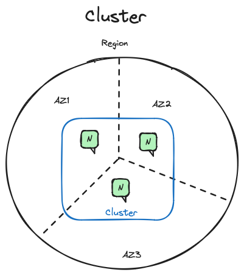
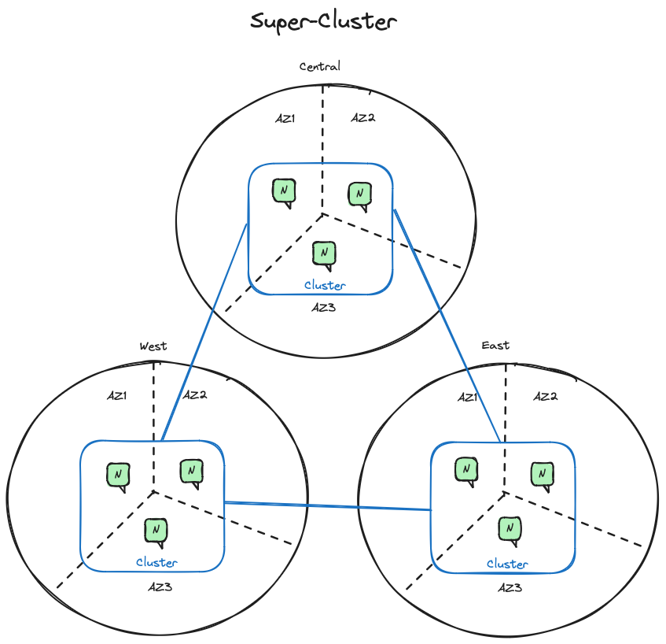
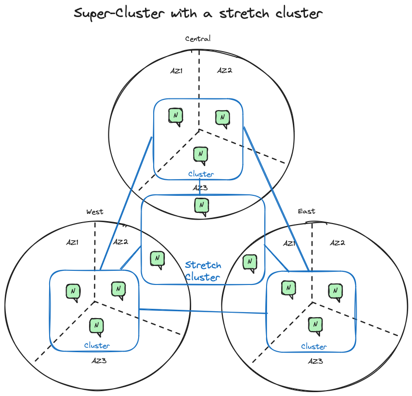
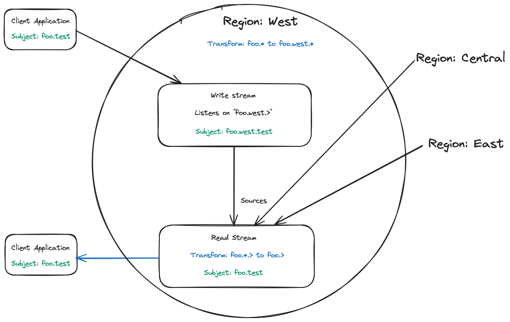

+++
date = "2023-12-25"
draft = false
title = "Distributed Multi-Region Stream Consistency: have your cake and eat it too!"
author = "Jean-Noël Moyne"
categories = ["Engineering"]
tags = ["NATS", "JetStream", "Streams", "Multi-Cluster", "Eventual Consistency"]
+++

# Introduction
Whether it is because of the need for the data to be closer to the users in order to meet latency requirements, because of the need to be resilient to a disaster such as a site or cloud provider regional outage, or even because of regulatory requirements, many companies are looking to deploy their applications over multiple availability zones, sites, regions or cloud providers. And when you step into these kinds of geographically distributed deployments you need to worry about the distribution, replication and consistency of your data, both for 'reads' and 'writes'.

In case you're not familiar with consistency models in distributed data stores just know that one of the ways distributed data stores can be classified is by their distributed consistency model: they can be either 'eventually' consistent, or 'immediately' consistent. Both models have their advantages and inconveniences: immediately consistent systems can offer features such as distributed shared queuing for distribution of messages between consumers or 'compare and set' operations for concurrency access control that are not possible with eventually consistent systems. On the other hand, eventually consistent systems can offer lower latency and better availability.

This blog post is about going over the spectrum of options offered by JetStream in terms of replication and consistency when deployed over multiple availability zones or sites or regions or cloud providers and how you can have both eventual and immediate consistency at the same time, and therefore have your cake and eat it too.

What is described here applies just as well to a deployment over multiple data centers, multiple regions within the same cloud provider, or multiple cloud providers or any combination thereof, but for the sake of simplicity we will use the regional terms 'regions' ('east', 'central' and 'west' in the examples) in the rest of this blog post.

What is described in this blog is purely about high availability and local data access and storage even in the face of disasters (entire regions going down or getting isolated from the other regions), if you need to extend NATS JetStream service to the edge and to places where the network connectivity is not always guaranteed, such as for example vehicles or mobile devices connecting over cellular networks, you should be looking at using [Leaf Nodes](https://docs.nats.io/nats-concepts/service_infrastructure/adaptive_edge_deployment#with-leaf-nodes) instead.

# Clustered JetStream
Within a cluster of NATS servers, JetStream offers immediate consistency using a RAFT voting protocol between the servers that replicate a stream. When a client application received the publication acknowledgement it is assured that the message has been safely replicated to (and persisted by) the majority of the servers.

The replicas for a particular stream are picked from the set of JetStream enabled servers in the cluster. So for example if you have a cluster of 9 servers only 3 of them will be involved in the message storing and RAFT voting of an R3 (3 replicas) stream. NATS's location transparency means that the client application can be connected to any server in the cluster and still be able to publish and consume from the stream.

JetStream allows you to control the placement of the stream replicas using [placement tags](https://docs.nats.io/nats-concepts/jetstream/streams#placement). For example, you can enhance availability by placing your servers in different availability zones within the same region/data center. You can then ensure using stream placement tags that the stream doesn't get placed on two servers in the same availability zone. You can also adjust the replication degree up and down at any time without interrupting the service to the stream, and even change the placement tags of the stream to move it to a different set of servers (also without interrupting the service).



Drawing of a cluster with 3 servers spanning 3 availability zones in a cloud region.

# Multi-Cluster JetStream
When you want to extend the JetStream system to multiple cloud providers/regions/data centers, you can use the JetStream Gateway feature to create a [Super-Cluster](https://docs.nats.io/nats-concepts/service_infrastructure/adaptive_edge_deployment#a-super-cluster). This feature allows you to connect clusters together such that you would have one cluster per cloud provider/region/data center. The location transparency of NATS and JetStream still applies in Super-Clusters: a client application can be connected to any server in any cluster and still transparently be able to publish and consume from the streams regardless of where the stream's replicating servers are located. 



Drawing of a Super-Cluster spanning 3 regions.

## Latency of operations in a Super-Cluster
This location transparency of NATS Super-Clusters is however still subject to the laws of physics and network latencies: operations on a stream located in a different cluster will have higher latency than operations on a stream located in the same cluster as the client application.

### Read operations
JetStream also has built-in mirroring or sourcing between streams: a stream can either mirror all the messages (or a subset, using subject-based filtering) from a single stream (in which case the message sequence numbers are preserved), or it can source from one or more streams (in which case the message sequence numbers are not be preserved) for example to aggregate between streams. This mirroring/sourcing is done in a reliable 'store and forward' manner, meaning that sourcing/mirroring streams (i.e. the nodes replicating the streams) can be shut down or disconnected from the source/mirror for a period of time and will automatically catch any messages they may have missed.

Beyond controlling the placement of stream replicas within a cluster, placement tags also allow you to control the placement of stream and replicas across clusters. You can specify which cluster a stream should be located in (e.g. a stream containing PII for European users can be set to be located in a cluster in the EU), and even change the placement tags of an existing stream to move it to a different cluster, without interrupting the service.

In this mode of deployment you can have a stream located in one regional cluster and create mirrors of this stream in other regional clusters, which is the classic way to scale and provide faster read access to the client applications by having them use the mirror stream of the clusters they are connected to (this happens automatically for KV `get()` operations), at the expense of a certain amount of 'incoherence' which is unavoidable any time any kind of 'cache' (in this case the mirror stream) is used. This 'eventual coherency' is due to the fact that it takes a non-null (though typically very small, but could be longer in the case of network or hardware outages) amount of time for the mirrors to be updated with new message addition/deletion in the stream being mirrored. It is sometimes amalgamated with the term 'eventual consistency' but technically it is not the same thing: the 'writes' happen only on the (immediately consistent) origin stream, therefore they are serialized and there is only one view of the stream at any given time, and the mirrors are eventually coherent with the origin stream. This is different from an eventual consistent system where the 'writes' can happen at the same time in different regions and the system has to deal with the fact that there can be multiple views of the data (e.g. in a different order) at any given time.

### Write operations
Deploying mirrors does help scale and provides low latency for read operations, it does not however help scaling or providing high availability between the regions when it comes to 'writes': the origin stream is located on a cluster that is in a single region, if that region goes down entirely while other regions can still read from their mirrors of the stream, the client applications will not be able to write to the stream until the region comes back up.

# Immediately Consistent Multi-region Stretch Clusters
When you need immediate consistency between regions, regardless of any particular region going down, you can still do that with JetStream thanks to its implementation of RAFT which works even between regions. This is done by creating a 'stretch cluster' where the cluster nodes are located in each one of _*at least*_ 3 regions. You then add this stretch cluster to your existing super-cluster (one cluster per region) and use stream placement tags to create streams that are stored in the stretch cluster. Those streams will be immediate consistent between regions, at the expense of higher latency. They will also be highly available as long as only one of the regions goes down, and if you can stretch (pun intended) to 5 regions then you can even survive two regions going down. Note that higher latency doesn't necessarily mean lower throughput, as long as your applications can leverage asynchronous publish operations.

You can combine this with the mirroring/sourcing feature to create mirrors of the streams on the stretch cluster into the regional clusters in order to have low read latency, but the latency on write operations will always be proportional to the latency between the regions.

## Real-world example
With proper choice of your 'regions' and provisioning of the network connection between them, you can still get pretty good latency of write and read operations on those stretched streams. If you are interested in the details of an actual production implementation of a stretch cluster spanning multiple cloud providers where the P99 write latency under load is < 20ms, you can view [Derek Collison's in-depth talk](https://www.youtube.com/watch?v=wvr0C0DfILU) at the [P99]( https://www.p99conf.io) conference.



Drawing of a Super-Cluster with a stretch cluster spanning 3 regions

# Eventually Consistent Multi-region 'virtual stream'
While immediate consistency is the highest quality of service, there are many use cases where you know from the business or application logic that it is not needed. Basically, if you know it is not possible for the same 'key' to be modified from two different places (regions) at the same time (while there is an outage or network split) then you do not _need_ immediate consistency.

Thanks to new JetStream features introduced in version 2.10 you can now create a 'virtual stream' that is globally distributed (i.e. to all regions) meaning that client applications to transparently publish to and read from with the low latency of interacting with a local (to the region) stream regardless of the region they are connected to, while still retaining eventual consistency between the regions with the single caveat that global ordering of the messages on that virtual stream is not guaranteed.

I say the stream is 'virtual' because unbeknownst to the client applications they are actually interacting with a number of streams (two per region) that source from each-other. 

## How it works
At a very high level, in each region there is a 'write stream' and a 'read stream' and the read streams source from the write streams.

The client applications publish to the write stream and read from the read stream for the region they are connected to, this happens transparently for the application using the Core NATS subject mapping and transformation feature, which (as of 2.10) can also be cluster-scoped.

While this is conceptually very simple, the actual implementation is a little bit complicated by the fact that Core NATS messages flow freely between the clusters in a Super-Cluster (and between Leaf Nodes unless some kind of filtering is applied at the authorization level), combined with the fact that you can not have more than one stream listening on the same subject, Also, you can not create 'loops' in the sourcing between streams (i.e. stream A sources from stream B and stream B sources from stream A).

So how is this possible? By using a number of the new features introduced in NATS version 2.10:
- The introduction of subject mapping and transformation features at the stream level (i.e. as part of the stream definition level as opposed to the Core NATS account level).
- The existing Core NATS subject mapping and transformation has been extended with the ability to define 'cluster-scoped' mappings and transformations.
- The relaxation of some of the stream sourcing and subject mapping and transformation rules including to allow the dropping of a wildcard subject token as part of the transformation (unless the mapping is part of a cross-account import/export).

### Writes to the virtual stream
For each region there is a 'write' stream located in that regional cluster that captures the messages published on subjects prepended with a subject token designating the region this stream is servicing. The stream listens to subjects that contains a token identifying the region.

For a simple example for a virtual stream `foo` capturing messages published on subjects matching `foo.>` (i.e. any subject starting with the token `foo`), in the region west the write stream could be called `foo-write-west` and listen on `foo.west.>` (you can change the order of the subject tokens and use wildcards to suit your needs).

Once you have done that in all your regions you can JS publish (from anywhere) a message on `foo.west.>` and it will be persisted in the write stream in region west. But that means the client application has to know which region it is connected to in order to know which subject name to publish to. This can be remediated by setting up some Core NATS subject mappings (which are defined at the account level) and defining a cluster scoped subject mapping per region such that in our example there is a subject mapping from `foo.>` to `foo.west.>` that applies only for cluster `west`, which means that any application connected to the `west` cluster that publishes a message on subject starting with `foo` will transparently be the same as if they had published it starting with `foo.west`.

### Eventually replicate the writes to the virtual stream
The second set of streams underlying the virtual stream are the 'read' streams, that source the 'write' streams, and strip the token indicating the region of origin from the subject.

So using the same simple example on region 'west' there would be a stream `foo-read-west` that doesn't listen to any subjects and sources from the stream `foo-write-east`, `foo-write-central` and `foo-write-west` and then strips the region name token by applying a subject transform from `foo.*.>` to `foo.>` (i.e. dropping the second token of the subject name). This means that the messages in the 'read' streams are under subjects starting with `foo`, the same subject the publishing application used (you can still tell which region the message was published in from a message header).

Because of the reliable store-and-forward stream sourcing mechanism you are ensured that all the 'read' streams will eventually contain all the messages published on all the 'write' streams, although not necessarily in the same order. 

### Reading from the virtual stream
Except for streams where the 'direct get' option is enabled (e.g. KV buckets) where direct get operations are automatically directed to any of the nodes within the local cluster replicating a mirror of the stream, if a client application wants to interact with a locally mirrored or sourced stream it needs to know the name of local stream, which means that it needs to know which region it is connected to. Avoiding this constraint is just like transparently dealing with publications to the virtual stream and can be done with setting a few (cluster-scoped) subject mapping transformations for the account at the Core NATS level.

Besides the aforementioned direct get requests the way client application 'read' (or consume) messages from a stream is through creating JetStream consumers (shared or not) and that is implemented over a number of JetStream API subjects which (unless JS domains are used) start with `$JS.API`, and also contain either a stream name or a consumer name as a token that subject. Such that for example requests to create consumers on a stream `foo` are transparently transformed into requests to create consumers on the local `<region>-read-foo` stream instead.

So for example: define a cluster-scoped subject mapping from `"$JS.API.CONSUMER.CREATE.foo.*"` to `"$JS.API.CONSUMER.CREATE.foo-read-west.{{wildcard(1)}}"` on cluster `west` such that any application connected to that cluster and creating a consumer on stream `foo` will actually create a consumer on stream `foo-read-west`.

## What you can NOT do with a virtual stream
- The retention policy of the virtual stream can not be a 'working queue' or 'interest' (i.e. only 'limits').
- It does not work for KV buckets unless you know that you are not modifying the same key at the same time (or during a split brain) from two different regions.
- Stream consumers are 'per region', meaning you do not have a global named durable consumer on the virtual stream, but multiple regional ones.
- Deleting individual messages from a virtual stream is not possible, the delete operation will only apply to the local 'read' stream and are not propagated (and neither should they be, as the message sequence numbers are not homogeneous between regions).
- Compare-and-set operations are not possible on the virtual stream as you actually read from one stream and write to another and the message sequence number are not preserved between them.

# Walkthrough
In this example we're going to walkthrough setting up a local Super-Cluster and creating a virtual stream 'foo' 
Make sure to install (or upgrade to) the latest version of the [NATS server](https://github.com/nats-io/nats-server/releases/latest) and of the [`nats` CLI tool](https://github.com/nats-io/natscli#installation) on your local machine.

```bash
git clone https://github.com/ConnectEverything/eventually_consistent_global_stream.git
```

## The setup
This walkthrough will create and start locally a total of 9 nats-servers organized in 3 clusters `east`, `central` and `west` of 3 nodes each interconnected as a Super-Cluster. Once those servers are started it will create all the 'read' and 'write' streams for all 3 regions.

You will then be able to play with the virtual stream `foo` using `nats` by connecting to different local clusters and using and publishing or reading with the (virtual) stream `foo` as if it was a single globally replicated stream.

## Server configurations
The individual server configuration files are straightforward, each server establishes route connections to it's 2 other peers in the cluster, and the cluster are connected together via gateway connections. In this example all the individual server's configuration files import a single `mappings.cfg` file containing all the Core NATS account level subject mapping transforms, which in this case are all cluster-scoped. If you were running your servers in the 'operator' security mode, those mappings would be stored (in the account resolver) as part of the account(s) JWT(s) instead.

`mappings.cfg`:
```
mappings = {
        "foo.>":[
               {destination:"foo.west.>", weight: 100%, cluster: "west"},
               {destination:"foo.central.>", weight: 100%, cluster: "central"},
               {destination:"foo.east.>", weight: 100%, cluster: "east"}
        ],
        "$JS.API.STREAM.INFO.foo":[
               {destination:"$JS.API.STREAM.INFO.foo-read-west", weight: 100%, cluster: "west"},
               {destination:"$JS.API.STREAM.INFO.foo-read-central", weight: 100%, cluster: "central"},
               {destination:"$JS.API.STREAM.INFO.foo-read-east", weight: 100%, cluster: "east"}
        ],
        "$JS.API.CONSUMER.DURABLE.CREATE.foo.*":[
               {destination:"$JS.API.CONSUMER.DURABLE.CREATE.foo-read-west.{{wildcard(1)}}", weight: 100%, cluster: "west"},
               {destination:"$JS.API.CONSUMER.DURABLE.CREATE.foo-read-central.{{wildcard(1)}}", weight: 100%, cluster: "central"},
               {destination:"$JS.API.CONSUMER.DURABLE.CREATE.foo-read-east.{{wildcard(1)}}", weight: 100%, cluster: "east"}
        ],
        "$JS.API.CONSUMER.CREATE.foo.*":[
               {destination:"$JS.API.CONSUMER.CREATE.foo-read-west.{{wildcard(1)}}", weight: 100%, cluster: "west"},
               {destination:"$JS.API.CONSUMER.CREATE.foo-read-central.{{wildcard(1)}}", weight: 100%, cluster: "central"},
               {destination:"$JS.API.CONSUMER.CREATE.foo-read-east.{{wildcard(1)}}", weight: 100%, cluster: "east"}
        ],
        "$JS.API.STREAM.MSG.GET.foo":[
               {destination:"$JS.API.STREAM.MSG.GET.foo-read-west", weight: 100%, cluster: "west"},
               {destination:"$JS.API.STREAM.MSG.GET.foo-read-central", weight: 100%, cluster: "central"},
               {destination:"$JS.API.STREAM.MSG.GET.foo-read-east", weight: 100%, cluster: "east"}
        ],
        "$JS.API.STREAM.MSG.DIRECT.foo":[
               {destination:"$JS.API.STREAM.DIRECT.GET.foo-read-west", weight: 100%, cluster: "west"},
               {destination:"$JS.API.STREAM.DIRECT.GET.foo-read-central", weight: 100%, cluster: "central"},
               {destination:"$JS.API.STREAM.DIRECT.GET.foo-read-east", weight: 100%, cluster: "east"}
        ],
        "$JS.API.STREAM.MSG.DELETE.foo":[
               {destination:"$JS.API.STREAM.MSG.DELETE.foo-read-west", weight: 100%, cluster: "west"},
               {destination:"$JS.API.STREAM.MSG.DELETE.foo-read-central", weight: 100%, cluster: "central"},
               {destination:"$JS.API.STREAM.MSG.DELETE.foo-read-east", weight: 100%, cluster: "east"}
        ],
        "$JS.API.CONSUMER.MSG.NEXT.foo.*":[
               {destination:"$JS.API.CONSUMER.MSG.NEXT.foo-read-west.{{wildcard(1)}}", weight: 100%, cluster: "west"},
               {destination:"$JS.API.CONSUMER.MSG.NEXT.foo-read-central.{{wildcard(1)}}", weight: 100%, cluster: "central"},
               {destination:"$JS.API.CONSUMER.MSG.NEXT.foo-read-east.{{wildcard(1)}}", weight: 100%, cluster: "east"}
        ],
        "$JS.ACK.foo.>":[
               {destination:"$JS.ACK.foo-read-west.>", weight: 100%, cluster: "west"},
               {destination:"$JS.ACK.foo-read-central.>", weight: 100%, cluster: "central"},
               {destination:"$JS.ACK.foo-read-east.>", weight: 100%, cluster: "east"}
        ]
}
```

## Start the servers
You can start the entire Super-cluster using the provided simple script.
```bash
source startservers
```
This script also defines 3 `nats` contexts to allow you to easily select which cluster you want to connect to: `sc-west`, `sc-central` and `sc-east`.
## Defining the local streams
After a few seconds the Super-Cluster should be up and running, and then define for the first time all the required local streams that are configured using JSON files and there is a simple convenience script to define them all.
```bash
source definestreams
```

Taking the `west` cluster as an example below are the JSON stream definitions for both streams.

The local 'write' stream is quite straight forward: it is named `"foo-write-west"` and all it needs to do is listen on the subjects `"foo.west.>"`:

`foo-write-west.json`:
```json
{
  "name": "foo-write-west",
  "subjects": [
    "foo.west.>"
  ],
  "retention": "limits",
  "max_consumers": -1,
  "max_msgs_per_subject": -1,
  "max_msgs": -1,
  "max_bytes": -1,
  "max_age": 3600000000000,
  "max_msg_size": -1,
  "storage": "file",
  "discard": "old",
  "num_replicas": 3,
  "duplicate_window": 120000000000,
  "placement": {
    "cluster": "west"
  },
  "sealed": false,
  "deny_delete": false,
  "deny_purge": false,
  "allow_rollup_hdrs": false,
  "allow_direct": false,
  "mirror_direct": false
}
```

Note that in this example a max-age limit of `3600000000000` (1 hour) set on the 'write' streams, meaning that the maximum length of a regional outage or split-brain that can be recovered from without any message write loss is 1 hour. You need a limit to ensure that the 'write' streams don't just grow forever as they only need to hold data for as long as the outage lasts, adjust this limit to fit your specific requirements. 

The local 'read' stream doesn't listen to any subjects and sources all the 'write' streams (see the `sources` array) and performs a simple subject transformation to drop the token in the subject name that contains the name of the region of origin (see the `subject_transform` stanza).

`foo-read-west.json`:
```json
{
  "name": "foo-read-west",
  "retention": "limits",
  "max_consumers": -1,
  "max_msgs_per_subject": -1,
  "max_msgs": -1,
  "max_bytes": -1,
  "max_age": 0,
  "max_msg_size": -1,
  "storage": "file",
  "discard": "old",
  "num_replicas": 3,
  "duplicate_window": 120000000000,
  "placement": {
    "cluster": "west"
  },
  "subject_transform": {
    "src":"foo.*.>",
    "dest":"foo.>"
  },
  "sources": [
    {
      "name": "foo-write-west",
      "filter_subject": "foo.west.>"
    },
    {
      "name": "foo-write-east",
      "filter_subject": "foo.east.>"
    },
    {
      "name": "foo-write-central",
      "filter_subject": "foo.central.>"
    }
  ],
  "sealed": false,
  "deny_delete": false,
  "deny_purge": false,
  "allow_rollup_hdrs": false,
  "allow_direct": false,
  "mirror_direct": false
}
```

So using the region 'west' as an example a message published on `foo.test` by an application connected to the 'west' cluster will be first stored with the subject `foo.west.test` in the `foo-write-west` stream and the stream `foo-read-west` sources from `foo-write-west` and strips the second token of the subject such as the message ends up being stored in that stream with the subject `foo.test`.



Drawing of the transformation of the subject of a message published on `foo.test` in region 'west' as it makes its way from a publishing to a consuming client application.

## Interacting with the global stream

You can use `nats --context` to interact with the stream as would a client connecting to the different clusters.

For example let's connect to the 'west' cluster and publish a message on the subject `foo.test`:
```bash
nats --context sc-west req foo.test 'Hello world from the west region'
```
Using `nats req` rather than `nats pub` here in order to see the JetStream publish acknowledgement just like a client application would when using the JetStream `publish()` call and checking that the `PubAck` does not contain an error.

We can then check that the message has indeed propagated to all the regions, in this example using the `nats stream view` command (that creates an ephemeral consumer on the stream and then iterate over it to get and display the messages).
```bash
nats --context sc-west stream view foo
```

You can see that the message stored in the global virtual 'foo' stream is indeed there with the subject `foo.test` which we used earlier to publish the message. Let's check that the message has also made it to the other clusters:
```bash
nats --context sc-central stream view foo
```
and
```bash
nats --context sc-east stream view foo
```
You can also even do a `nats stream info` on the virtual stream (this will show you the info about your local 'read' stream), but note how `nats stream ls` doesn't show the global virtual stream, but rather all of its (non-virtual) underlying local streams.

## Simulating disasters
You can simulate whole regions going down by killing all of the `nats-server` processes for a region, there are some simple convenience scripts in the repository to kill or restart regions easily.

### Killing one region
For example: let's first kill the central region cluster
```bash
source killcentral
```
Then publish message from or 'east'
```bash
nats --context sc-east req foo.test 'Hello world from the east region'
```
Check that the message made it to 'west'
```bash
nats --context sc-west stream view foo
```
Then restart 'central'
```bash
source startcentral
```
It may take up to a couple seconds for the recovery to complete then check that the message is now there in 'central'
```bash
nats --context sc-central stream view foo
```

### Killing two regions go down at once and simulating a split brain
The two failure scenarios are similar and related: a split brain from the point of view of the region getting isolated is no different from both of the other two regions going down at the same time.

The difference being that in the case of split brain, the two other regions that can still see each other continue to operate normally (including processing new 'writes') and the isolated regions ends up in the same 'limited' mode of operation as in the case when two regions do down at the same time.  

As soon at the network partition gets resolved or as the missing regions come back up the two parts of the brain will replicate missed messages between themselves and eventually become consistent again (though not necessarily in the same order).

In case of two regions going down at the same time or of being the smaller part of the split brain the remaining region can still operate but in a 'limited' fashion, as not all functionality will be available since there will be an inability for the remaining nodes to elect a JetStream 'meta leader'.
- Publications to the stream _will still work_, the only way publications to stream in a regions would stop working is if 2 of the 3 servers in the region (or 2 out of 5) go down at the same time.
- Get operations (e.g. what the KV 'get' operation uses) _will still work_.
- Getting messages from already existing consumers (at the time the second regions goes down) on the stream _will still work_, and locally published messages will be seen in the 'read' stream right away.
- However, creating new consumers (or new Streams) _will not work_.

First kill both 'west' and 'east'
```bash
source killwest; source killeast
```
Publish a new message on 'central' (as if it was isolated region)
```bash
nats --context sc-central req foo.test 'Hello world from the central region'
```
Then bring down the 'central' region and 'east and 'west' back up
```bash
source killcentral; source startwest; source starteast
```
Wait up to a couple seconds and publish another message from one of those two regions
```bash
nats --context sc-east req foo.test 'Hello again from the east region'
```
Check you can create a new consumer and see that message from the other region
```bash
nats --context sc-west stream view foo
```
And finally resolve the split brain by restarting 'central'
```bash
source startcentral
```
After a few seconds you can see that all the messages where are now present in all the 'read' streams, though not necessarily in the same order by comparing the output of
```bash
nats --context sc-west stream view foo
```
With
```bash
nats --context sc-central stream view foo
```

# What if you still want global ordering?
You can use a stretch cluster to home a 'master' stream and have the local read streams mirror that stream. The write streams remain the same and that master stream sources from them. Compared to simply having the stream located in the stretch cluster and the read streams mirroring it, and having the client applications just publish directly to the stretched stream, this provides lower 'write' latency (the high availability remains the same either way) but does take away the 'compare-and-set' functionality (e.g. the KV Update operation) that you still retain when writing directly to the stretched stream.

# Conclusion
When it comes to multi-region/cloud/site/etc... active-active consistent 'global' deployments, NATS JetStream not only has all the needed functionality built-in but also has a lot of flexibility when it comes to replication, mirroring, sourcing, and generally creating local consistent copies of the data including the ability to have (on a per-stream basis) the choice between immediate or eventual global consistency. And leveraging some of the new features of 2.10, you can make eventually consistent globally distributed streams in a manner that is completely transparent to the client applications, such that the client application doesn't even need to know (e.g. need to be configured with a region name) which region it is deployed in, and yes still have both reading from and writing to the stream handled by the local regional NATS servers (thereby with low latency).

When it comes to global distributed immediate or eventual data consistency with JetStream you can indeed have your cake and eat it too!
